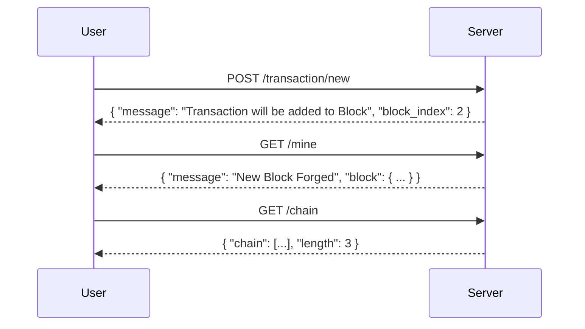
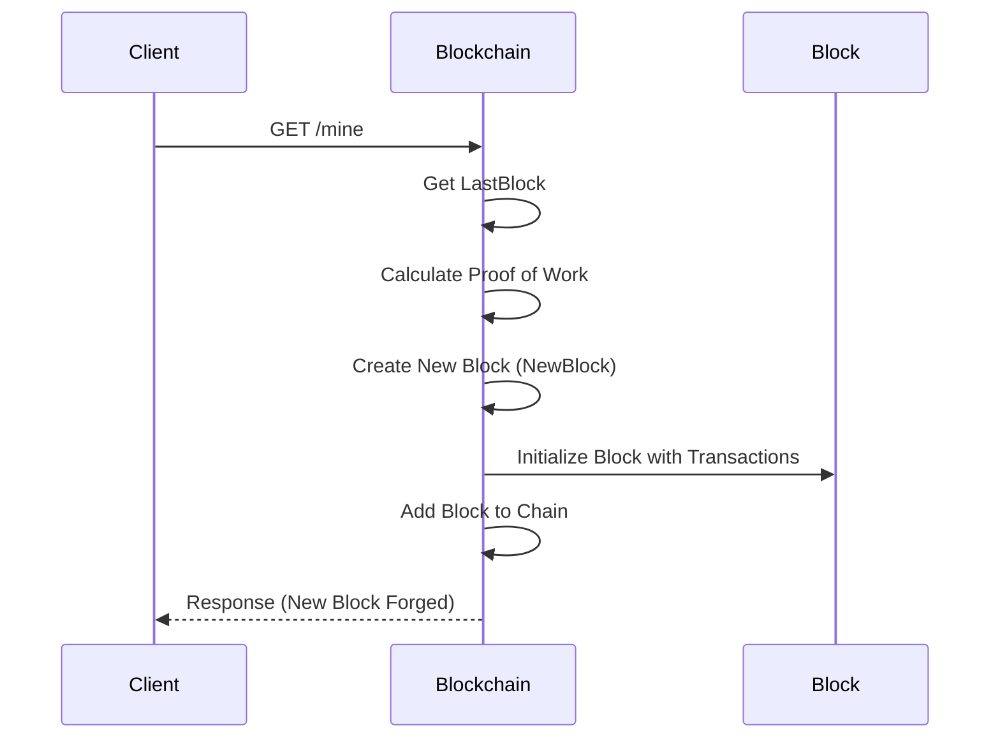
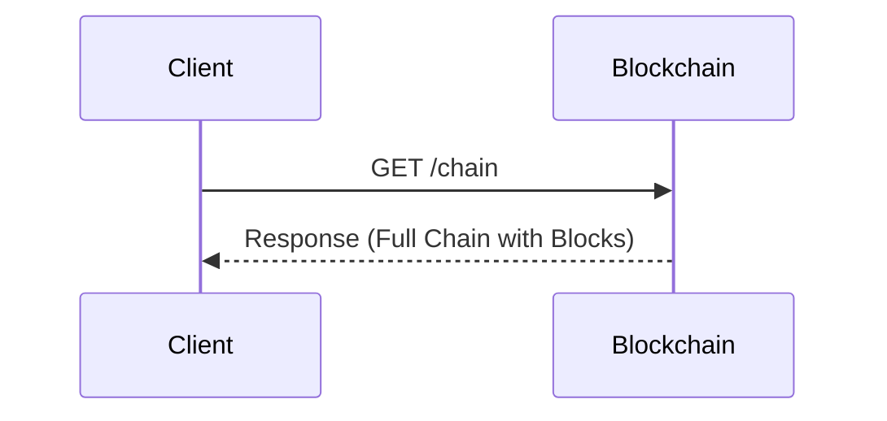
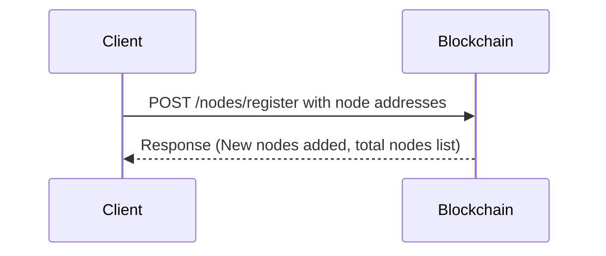
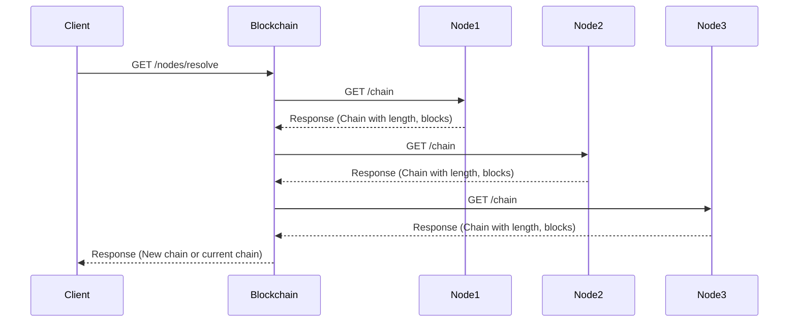

# DIY Blockchain

## Table of Contents

1. [Introduction](#introduction)
2. [Features](#features)
3. [API Endpoints](#api-endpoints)
   1. [API Interaction Flow](#1-api-interaction-flow)
   2. [Create a New Transaction](#2-create-a-new-transaction)
   3. [Mine a New Block](#3-mine-a-new-block)
   4. [Retrieve the Entire Blockchain](#4-retrieve-the-entire-blockchain)
   5. [Add Nodes to the network](#5-add-nodes)
   6. [Resolve Conflicts](#6-resolve-conflicts)
4. [Blockchain Structure](#blockchain-structure)
5. [Blockchain squence diagram](#blockchain-squence-diagram)
6. [How to Run the Project](#how-to-run-the-project)
7. [Conclusion](#conclusion)

## Introduction

This project is a simple, educational implementation of a blockchain with an API to interact with it. It is inspired by the article [Learn Blockchains by Building One](https://hackernoon.com/learn-blockchains-by-building-one-117428612f46) and serves as a hands-on way to understand how blockchains work. The API provides endpoints for creating new transactions, mining blocks, and viewing the entire blockchain.

### Project Goal

The goal of this project is to build a basic blockchain system and expose it via an API that allows you to:
- Create transactions.
- Mine new blocks and add them to the chain.
- Retrieve the full blockchain.

This is a side project intended to give insight into the workings of blockchain technology.

## Features

- **Create Transactions**: Add new transactions that will be stored in the blockchain.
- **Mine Blocks**: Mine new blocks that include the transactions, proving the validity of the new block.
- **View Blockchain**: Retrieve the entire chain to visualize the blocks and transactions.
- **Add New Node**: This feature allows a new node (i.e., a server or participant) to join the blockchain network. By registering a new node, it can participate in mining, transactions, and chain validation.
- **Validate Chain (Resolve Conflicts)**: This feature allows a node to validate its blockchain and resolve any conflicts that may exist between chains, typically when there are competing blocks from different nodes. The node will replace its chain with the longest, valid chain available.

## API Endpoints

### 1. API Interaction Flow


### 2. Create a New Transaction

- **Endpoint**: `POST /transactions/new`
- **Description**: Add a new transaction to the list of current transactions.
- **Request Body**:
    ```json
    {
      "sender": "sender_address",
      "recipient": "recipient_address",
      "amount": amount
    }
    ```
- **Example Request**:
    ```bash
    curl 'http://localhost:8080/transactions/new' -X POST -H 'Accept: application/json' -H 'Content-Type: application/json'  --data-raw $'{\n  "sender": "pablo",\n  "recipient": "raul",\n  "amount": 100\n}' | jq
    ```
- **Response**:
    ```json
    {
      "block_index": 2,
      "message": "Transaction will be added to Block"
    }
    ```

### 3. Mine a New Block

- **Endpoint**: `GET /mine`
- **Description**: Mine a new block that includes all the current transactions, and add it to the blockchain.
- **Example Request**:
    ```bash
    curl 'http://localhost:8080/mine' -H 'Accept: application/json'
    ```
- **Response**:
    ```json
    {
      "block": {
        "index": 2,
        "timestamp": 1731268118,
        "transactions": [
          {
            "sender": "pablo",
            "recipient": "raul",
            "amount": 100
          }
        ],
        "previous_hash": "189f74e5af683c26f1a777dae58ae160c1a898e1ac6a8894f8a78a8833bd87f8",
        "proof": 69732,
        "hash": "013ba9e1e42d7b22756b0d306f6d42c7d0e7fffb615c803b594a3f4b7c289d82"
      },
      "message": "New Block Forged"
    }
    ```

### 4. Retrieve the Entire Blockchain

- **Endpoint**: `GET /chain`
- **Description**: Retrieve the entire blockchain, showing all blocks and transactions.
- **Example Request**:
    ```bash
    curl 'http://localhost:8080/chain'
    ```
- **Response**:
    ```json
    {
      "chain": [
        {
          "index": 1,
          "timestamp": 1731268723,
          "transactions": [
            {
              "sender": "pablo",
              "recipient": "raul",
              "amount": 100
            }
          ],
          "previous_hash": "0",
          "proof": 69732,
          "hash": "feed907b79796462843fe72776323fabdce575d4621b93510a3a83e1be28e844"
        },
        {
          "index": 2,
          "timestamp": 1731268737,
          "transactions": [
            {
              "sender": "pablo",
              "recipient": "mariano",
              "amount": 100
            }
          ],
          "previous_hash": "feed907b79796462843fe72776323fabdce575d4621b93510a3a83e1be28e844",
          "proof": 69733,
          "hash": "658ec8e1681b9e1ff3419118824a2c94590a16e9616214646d5512d88ab741a7"
        }
      ],
      "length": 2
    }
    ```

### 5. Add Nodes

- **Endpoint**: `POST /nodes/register`
- **Description**: Adds new nodes to the blockchain network.
- **Request Body**:
    ```json
    {
    "nodes": [        
    "http://localhost:8081",
    "http://localhost:8082"
    ]
    }
  ```

- **Response**:
    ```json
    {"message":"New nodes have been added","total_nodes":{"http://localhost:8080":true,"http://localhost:8081":true}}
    ```

### 6. Resolve Conflicts

- **Endpoint**: `GET /nodes/resolve`
- **Description**: Resolves conflicts in the blockchain network by replacing the chain with the longest valid one.
- **Response**:
```json
{
  "chain": [
    {
      "index": 1,
      "timestamp": 1733080046,
      "transactions": [],
      "previous_hash": "0000",
      "proof": 100,
      "hash": "501659aea6b48c6c37952020c0ac3e80c4a4616b3cbba8ae1e54e51704c0ed89"
    },
    {
      "index": 2,
      "timestamp": 1733080107,
      "transactions": [
        {
          "sender": "pablo",
          "recipient": "raul",
          "amount": 100
        }
      ],
      "previous_hash": "501659aea6b48c6c37952020c0ac3e80c4a4616b3cbba8ae1e54e51704c0ed89",
      "proof": 137443,
      "hash": "729444188c83c2ba1e2e7c3d2694ab29fab99c0bdaaa3fca7b42d55298f45886"
    },
    {
      "index": 3,
      "timestamp": 1733080112,
      "transactions": [],
      "previous_hash": "729444188c83c2ba1e2e7c3d2694ab29fab99c0bdaaa3fca7b42d55298f45886",
      "proof": 13245,
      "hash": "f1299176939ab505db1b630564bb738ceaf1e41ad878619b6666642d925c389b"
    }
  ],
  "message": "Our chain is authoritative"
}
```

## Blockchain Structure

The blockchain is a list of blocks, each containing the following:
- **Index**: The position of the block in the chain.
- **Timestamp**: The time the block was created.
- **Transactions**: The list of transactions included in the block.
- **Previous Hash**: The hash of the previous block in the chain.
- **Proof**: A number used for proof-of-work consensus.
- **Hash**: The SHA-256 hash of the block.

The folowing "class" diagram provides an overview of the main entities and their relationships in the blockchain project:

- **Blockchain**:
  - Contains a list of `Block` objects representing the chain.
  - Manages `CurrentTransactions`, a list of `Transaction` objects for the current block.
  - Key methods include `NewBlock`, `NewTransaction`, `Hash`, `LastBlock`, `ProofOfWork`, `ValidProof`, `ValidChain`, `RegisterNode` and `ResolveConflicts`.

- **Block**:
  - Represents a block in the blockchain with attributes like `Index`, `Timestamp`, `Transactions`, `PreviousHash`, `Proof`, and `Hash`.

- **Transaction**:
  - Represents a single transaction with attributes for the `Sender`, `Recipient`, and `Amount`.

```mermaid
classDiagram
    class Blockchain {
        +[]Block Chain
        +[]Transaction CurrentTransactions
        +NewBlockchain() Blockchain
        +NewBlock(previousHash string) Block
        +NewTransaction(sender string, recipient string, amount int) int
        +Hash(block Block) string
        +LastBlock() *Block
        +ProofOfWork(lastProof int, previousHash string) int
        +ValidProof(lastProof int, proof int, previousHash string) bool
        +ValidChain(chain []Block) bool
        +RegisterNode(address string)
        +ResolveConflicts() bool
    }

    class Block {
        +int Index
        +int64 Timestamp
        +[]Transaction Transactions
        +string PreviousHash
        +int Proof
        +string Hash
    }

    class Transaction {
        +string Sender
        +string Recipient
        +int Amount
    }

    Blockchain "1" --> "*" Block : has many >
    Block "1" --> "*" Transaction : contains many >
  ```

## Blockchain squence diagram

 **1. New Transaction (`POST /transactions/new`)**:

```mermaid
sequenceDiagram
    participant Client
    participant Blockchain
    participant Block
    participant Transaction

    Client->>Blockchain: POST /transactions/new (sender, recipient, amount)
    Blockchain->>Transaction: Create Transaction
    Blockchain->>Blockchain: Add Transaction to CurrentTransactions
    Blockchain-->>Client: Response (transaction added)
```

  - The client sends a request with the `sender`, `recipient`, and `amount` to create a new transaction.
  - The `Blockchain` creates a `Transaction` and adds it to the `CurrentTransactions` list.
  - A response is sent to confirm the transaction was added.

 **2. Mine a New Block (`GET /mine`)**:



  - The client requests to mine a new block.
  - The `Blockchain` retrieves the last block, calculates the proof of work, and then creates a new block (`NewBlock`) containing the current transactions.
  - This new block is then added to the chain, and the client receives a response indicating the block has been successfully mined.


 **3. Retrieve the Blockchain (`GET /chain`)**:



  - The client requests the entire blockchain.
  - The `Blockchain` returns the full chain, including all blocks, in the response. 


**4. Add Node (`POST /nodes/register`)**:



- The Client sends a `POST` request to the Blockchain to register new nodes, including a list of node addresses in the request body
- Adds the new nodes to the network, and responds with a message confirming the addition of the nodes, along with the updated list of all nodes in the network.

**5. Resolve Conflicts (`GET /nodes/resolve`)**:


- Client makes a `GET /nodes/resolve` request to the Blockchain to resolve conflicts and find the most valid and longest chain
- The Blockchain sends `GET /chain` requests to each node in its network (Node1, Node2, Node3, etc.).
- Each Node responds with its chain (including the chain length and the blocks).
- Blockchain checks the received chains:
  - If a chain is longer than the current one and valid, it replaces its own chain.
  - If no valid longer chain is found, the current chain remains.
- After evaluating all nodes, Blockchain sends a response to the Client indicating whether it has replaced its chain with a new one or if the current chain remains authoritative.

## How to Run the Project

1. Clone the repository:

```bash
git clone https://github.com/pjgg/diy-blockchain.git
cd diy-blockchain
```

2. Install Go dependencies:

```bash
go mod tidy
```

3. Run the application:

```bash
go run main.go
```

4. The API should now be running on `http://localhost:8080`.


## Testing the API

There is an [OpenAPI spec](https://pjgg.github.io/diy-blockchain) that you could use as a helper. 

## Conclusion

Hashes ensure the integrity of the data, while the Proof-of-Work (PoW) function mitigates malicious attacks by requiring significant resources (electricity, time, hardware, etc.). Additionally, by taking the "Proof" and the hash of the previous block as inputs, if an attacker wanted to rewrite a block, they would also have to rewrite all subsequent blocks, making this practically unfeasible.

This simple blockchain API allows you to explore blockchain concepts by creating transactions, mining blocks, and viewing the blockchain. It's a great way to understand the fundamental mechanics of blockchain technology.